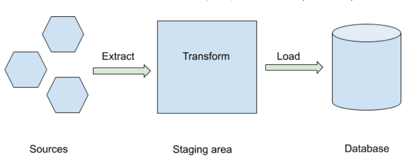

# Crowdfunding ETL Pipeline

## Overview
Building an ETL pipeline utilizing Python, Pandas, and Python dictionary methods to extract and transform the data. After this process, we created 4 CSV files, and used the CSV files to create an ERD and a table schema. The CSV files were then uploaded into a Postgres database. 

## Contributors
- Julia Liou
- Oguz Kilicarslan

## Resources

- [crowdfunding](Resources/crowdfunding.xlsx)
- [contacts](Resources/contacts.xlsx)

### Software utilized:
Jupyter Notebooks, Pandas, Numpy, PostGresSQL, QuickDBD

## Data Extraction and Transformation

### Category DataFrames
- A DataFrame is created for categories.
- The DataFrame contains a "category_id" column with sequential entries from "cat1" to "catn" for unique categories.
- The DataFrame has a "category" column that contains only the category titles.
- The category DataFrame is exported as category.csv.

### Subcategory DataFrame
- A DataFrame is created for subcategories.
- The DataFrame contains a "subcategory_id" column with sequential entries from "subcat1" to "subcatn" for unique subcategories.
- The DataFrame contains a "subcategory" column that contains only the subcategory titles.
- The subcategory DataFrame is exported as subcategory.csv.

### Campaign Dataframe 
- A DataFrame is created for campaigns.
- The DataFrame includes various columns such as "cf_id", "contact_id", "company_name", "description", "goal", "pledged", "outcome", "backers_count", "country", "currency", "launch_date", "end_date", "category_id", and "subcategory_id".
- The "launch_date" and "end_date" columns are formatted as "YYYY-MM-DD".
- The campaign DataFrame is exported as campaign.csv.

### Contacts DataFrame
- A DataFrame is created for contacts.
- The DataFrame includes columns for "contact_id", "first_name", "last_name", and "email".
- The contacts DataFrame is exported as [contacts.csv](Resources/contacts.csv).

## Database Creation and Import
### Crowdfunding Database
- Utilizing the 4 CSV files created, we created a ERD:
- We created a table schema for each CSV file (which includes the primary keys, foreign keys, and other constraints)
- The Database schema is crated as a Postgres file named crowdfunding_db_schema.sql 
- A new Postgres darabase was created: crowdfunding_db
- Import each CSV file into it's corresponding SQL table
- Can verify that each table has the correct data by running a SELECT statement for each.

## Usage
To run the ETL pipeline and populate the PostgreSQL database:

- Ensure you have Python and the required dependencies installed.
- Execute the [Jupyter Notebook](ETL_Mini_Project_JLiou_OKilicarslan.ipynb.ipynb) containing the ETL pipeline code.
- Verify that the CSV files are created and the PostgreSQL database is populated.
- Use SELECT statements to retrieve and analyze the data from the database.